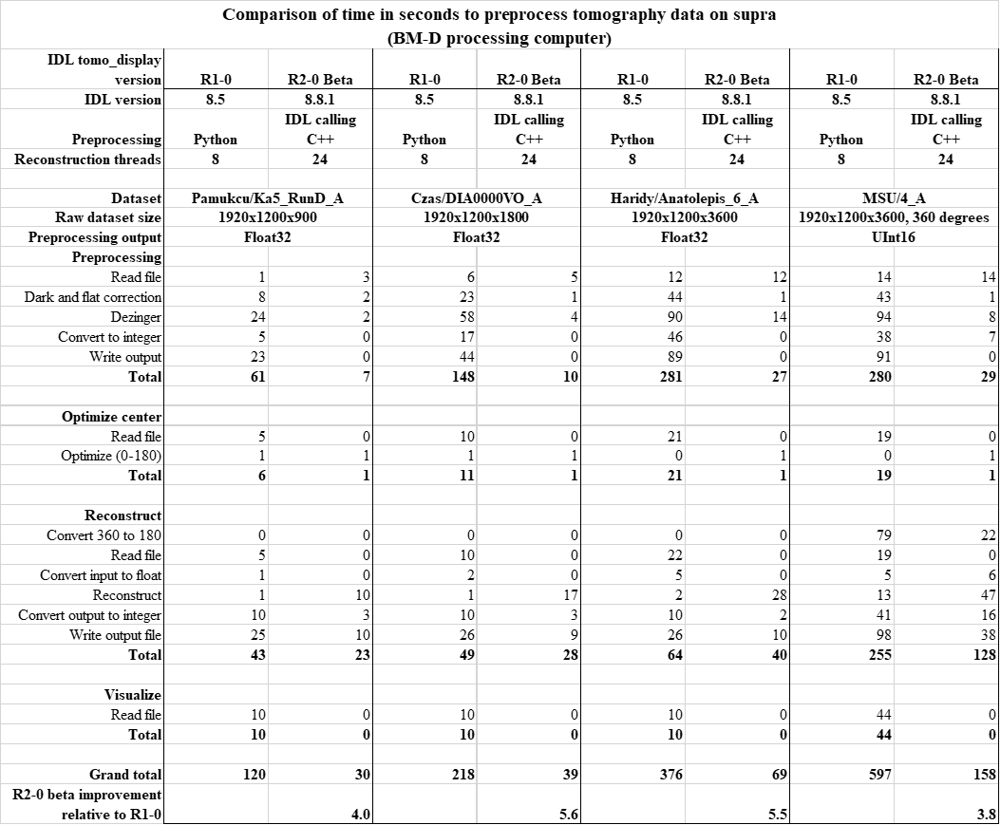

Benchmarks
----------
The following table compares the time for each of the steps for preprocessing, 
optimizing the rotation center, reconstruction, and visualization.  
The comparison is between the version of the software used through the end of 2022 (R1-0)
with the version introduced at the beginning of 2023 (R2-0 beta).
The comparison is done for 4 different dataset sizes.

The performance improvement between R1-0 and R2-0 is a factor of 3.8 to 5.6 depending on the dataset size.

The improved performance is due to a number of factors:

- Removing Python tomopy from the pipeline for normalization.
  The new IDL preprocessing is 10-15 times faster than Python.
  
    - The C++ code for normalization and zinger removal is faster than Python
    - The data are no longer converted to integer and saved as netCDF files, which are slow in Python.
- The data is kept in IDL memory between processing steps, rather than writing and reading the normalized data before
  reconstruction, and reading reconstructed data at the end for visualization.
- The reconstructed output files are now saved as HDF5 files, which are written about 2.5 times faster than netCDF files.

**TO DO:** Add benchmarks of the IDL processing code versus a complete tomopy pipeline.