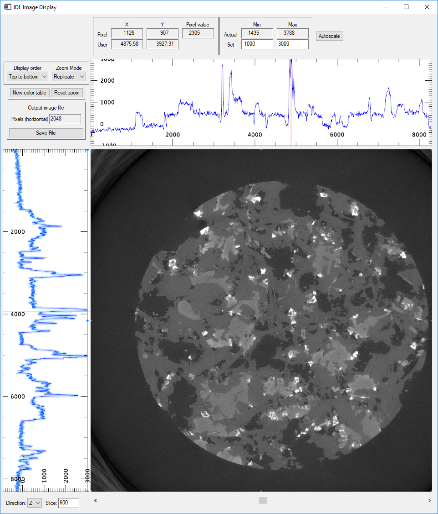

Visualize with image_display
----------------------------
**image_display** is written in IDL.  It can be passed a single 2-D slice, or a 3-D volume to visualize.
**image_display** can be called from tomo_display, directly from the IDL command line, or from other IDL applications.  

When using tomo_display the  **Display slice** button will call **image_display** for the currently selected direction and slice.
The **Display volume** button will pass the entire 3-D volume to **image_display**.  This is slower to start, because it makes a
copy of the entire volume before passing it.  The advantage of **Display volume** is that one can then load another volume and display it 
at the same time, allowing direct visual comparison of slices from multiple datasets.  However, one must be aware of the available
memory when using the 3-D display feature.

This shows the **image_display** window when loading a 3-D dataset with **Display volume**.  

    **image_display window with 3-D data currently displaying slice 600 in Z**

- The widgets at the bottom select the direction in which to view slices (X, Y, or Z) and the slice number to visualize. 
  The slice number can be entered directly, or selected with the slider bar.
- The mouse scroll wheel is used to zoom in and out.
- The widgets in the top-left show the coordinates of the mouse in the image window and the intensity at that pixel.
- The coordinates are displayed in both pixel units, and distance units (microns).  
  For raw or normalized projection data the Z axis units are degrees.
- The widgets in the top-right show the actual intensity range for the current slice.  
  The intensity range to use for the display can be manually set with the **Set** widgets, or scaled to the full range
  with the **Autoscale** button.
- The widgets on the left above the plot control the following:

  .. list-table::
    :widths: 20 80
 
    * - **Display order**
      - Controls whether the image is displayed with row 0 at the top or bottom.
    * - **Zoom mode**
      - Controls whether zooming is done with pixel replication or interpolation.
    * - **New color table**
      - Loads a color lookup table selector.  Select a color table, adjust the top, bottom, and gamma if desired,
        and press **Done**.
    * - **Reset zoom**
      - Resets the zoom so that the entire image is displayed as large as possible in the image window.
    * - **Pixels (horizontal)**
      - Sets the number of horizontal pixels in the the output image file when **Save file** is pressed.
        When saving in PDF format this number is the width of the image in inches.
    * - **Save file**
      - Saves the current image in one of the following file formats:
    
        - Windows bitmap (.bmp)
        - JPEG (.jpg or .jpeg)
        - PDF (.pdf)
        - PNG (.png)
        - TIFF (.tif or .tiff)

- The plots on the top and left of the image are the row and column profiles through the image at the current pixel position.
  The plot range in X is controlled by the image pan and zoom, and the plot range in Y is controlled by the selected Display
  intensity range.

