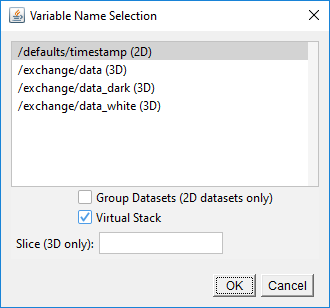
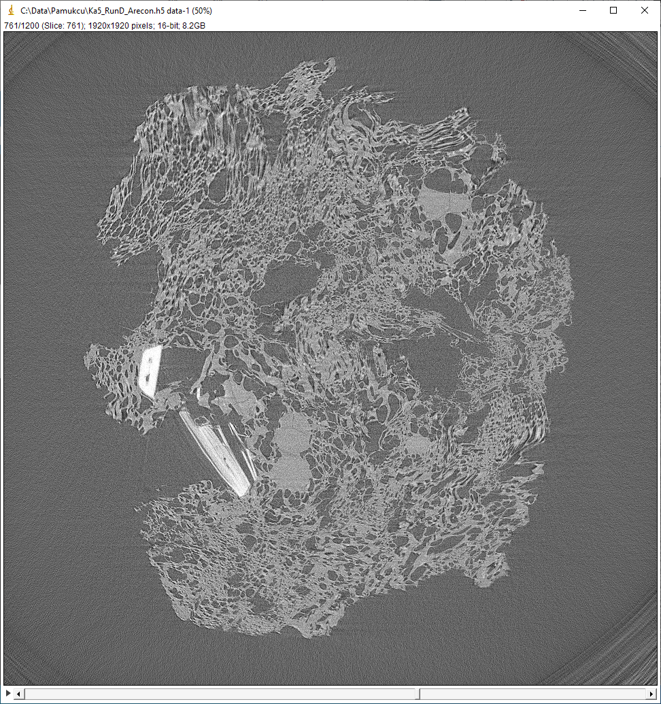

.. _IDL Tomography:       https://github.com/CARS-UChicago/IDL_tomography
.. _netCDF jar file:      https://lmb.informatik.uni-freiburg.de/resources/opensource/imagej_plugins/07.12.12/NetCDF\_.jar
.. _Freiburg HDF5 plugin: https://lmb.informatik.uni-freiburg.de/resources/opensource/imagej_plugins/hdf5.html
.. _PSI HDF5 plugin:      https://github.com/paulscherrerinstitute/ch.psi.imagej.hdf5
.. _PSI HDF5 releases:    https://github.com/paulscherrerinstitute/ch.psi.imagej.hdf5/releases

Visualize with ImageJ
---------------------
ImageJ is an excellent free program for displaying and analyzing tomography data.
ImageJ for Linux, Windows, and Mac can be downloaded from the
`ImageJ Website <https://imagej.nih.gov/ij/download.html>`__.

The download is a ZIP file that can be extracted to a location like ``C:\ImageJ`` on Windows
or ``/home/user/ImageJ`` or ``/usr/local/ImageJ`` on Linux.

netCDF plugin
~~~~~~~~~~~~~
The netCDF files written by **tomo_display** or the Python **preprocess_13bm.py** routines can be read into ImageJ
by copying the following files into the ImageJ/plugins folder

- `netCDF jar file`_ from the University of Frieburg.
- GSETomo\_.ijm from the `IDL Tomography`_ repository.  See the instructions in :ref:`Installation` for how to download this.

Open ImageJ and select ``Plugins/GSETomo``.  This will open a file browser to select a netCDF file.
The 3-D dataset in the file
will be opened as a stack in ImageJ

HDF5 plugin
~~~~~~~~~~~
There are 2 ImageJ plugins for reading HDF5 files.

- The `Freiburg HDF5 plugin`_.
  This plugin can only read datasets smaller than 2 GB, so it is not useful for reading most tomography datasets.
- The `PSI HDF5 plugin`_.
  This plugin is also limited to reading datasets smaller than 2 GB into "real" ImageJ stacks.
  However, it supports "virtual" ImageJ stacks, which can be any size.  Virtual stacks are not read into memory
  in their entirety, only the currently selected slice is actually in memory.
  This plugin is the one that should be used for reading GSECARS tomography data.

To install the PSI plugin copy the latest jar file from the `PSI HDF5 releases`_ to the ImageJ/plugins folder.
NOTE: If this is being installed in FIJI, rather than ImageJ it is first necessary to uninstall the Freiburg HDF5 plugin.
This is explained in the `PSI HDF5 plugin`_ README.md file.

The PSI plugin can be used directly to read the HDF5 "camera" files containing the flat fields and projections,
which are unsigned 16-bit integers.

Open ImageJ and select ``File/Import/HDF5...``.  This will open a file browser to select an HDF5 file.
After selecting the HDF file it will open the following window to select which dataset to read:

    **ImageJ HDF5 plugin dataset selection window**

This example is for reading a "camera" HDF5 raw data file, which contains 4 datasets.  
/exchange/data is the one with the projections, /exchange/data_white contains the flat fields.
Reconstruction and normalized HDF5 files only have a single dataset, /exchange/data.

The 3-D dataset in the file will be opened by default as a virtual stack in ImageJ.  Unchecking the ``Virtual Stack``
box in the selection window will generate an error because the dataset is larger than 2 GB.

The prefered data type for the reconstructed HDF5 files is signed 16-bit integers.  
This produces files that are 50% of the size of 32-bit floating point, with no practical loss of precision or range.
Unfortunately, ImageJ does not directly support signed 16-bit integers, so a scaling is needed
to correctly display the values. 
To read these files into ImageJ you need copy the following to the ImageJ/plugins folder.

-	The latest jar file from the `PSI HDF5 releases`_.
- ``Read_GSE_HDF5_recon.ijm`` from the `IDL Tomography`_ repository.
  See the instructions in :ref:`Installation` for how to download this.

There will then be a Plugins menu item titled “Read GSE HDF5 recon”.
Click on it and select the \*recon.h5 file.  It does the following:

-	Reads the HDF5 file into a virtual stack.
-	Duplicates the virtual stack to a real stack.
-	Applies scaling so that the signed 16-bit integer values are displayed correctly.
-	Closes the virtual stack.

This is an example of a reconstructed dataset read with the macro above:

    **ImageJ stack for HDF5 file with reconstructed data**

Incompatibility of netCDF and HDF5 plugins
~~~~~~~~~~~~~~~~~~~~~~~~~~~~~~~~~~~~~~~~~~
Unfortunately the netCDF and PSI HDF5 plugins referenced above are incompatible, meaning that they cannot both be
installed in the same ImageJ installation.
This is because they both use a Java logging utility, but they use incompatible versions.
The netCDF plugin uses a much older version.  
In principle this could be fixed by changing the Java source code of the netCDF plugin 
to use the more recent version of the logging utility.
This is not possible, however, because the source code for that plugin appears to have been lost.
I have contacted both the author, and the chair of the department at the University of Freiburg where the
author used to work, and neither are able to find it.

If both plugins are needed then the workaround is to have 2 separate installations of ImageJ or FIJI.
One will have the netCDF plugin and the other the HDF5 plugin.
