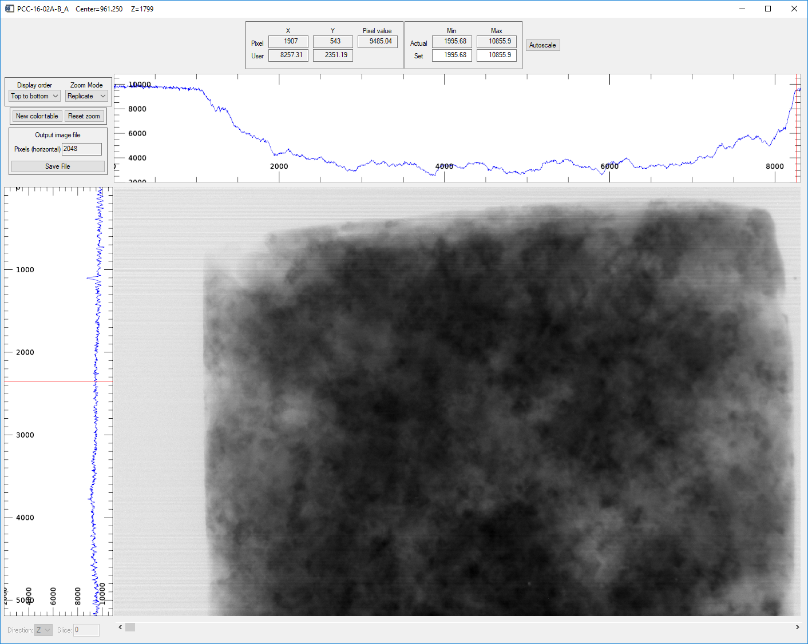

===========================
GSECARS Tomography Software
===========================

:author: Mark Rivers, University of Chicago

.. contents:: Contents

.. _IDL_Tomography:      https://github.com/CARS-UChicago/IDL_tomography
.. _IDL_Imaging:         https://github.com/CARS-UChicago/IDL_tomography
.. _tomo_display.sav:    https://cars.uchicago.edu/data/tomography/tomo_display/tomo_display.sav
.. _IDL:                 https://www.l3harrisgeospatial.com/Software-Technology/IDL
.. _IDL_Register:        https://www.l3harrisgeospatial.com/Company/Create-Account?returnurl=https%3a%2f%2fwww.l3harrisgeospatial.com%2fSoftware-Technology%2fIDL

Overview
--------

This document describes how to install the required software to reconstruct and 
visualize tomography data from the 13-BM-D beamline.  
This includes data collected both on the upstream tomography table, and that collected in the 250-ton press.
This software can be installed on Linux and Windows.  
A computer with at least 32 GB of RAM, at least 8 cores, and a fast solid-state hard disk for the data
is recommended.

The software consists of the following components:

- C++ library containing optimized code for preprocessing and reconstruction
- IDL_ class library called ``tomo`` that does the following:

  - Read raw data files
  - Preprocess using the C++ library
  - Optimize rotation center
  - Reconstruct using the C++ library
  - Save reconstructed data
  - Save and restore preprocessing and reconstruction parameters
- IDL visualization class called ``image_display`` that can display 2-D and 3-D data
- IDL GUI program called ``tomo_display`` that calls the ``tomo`` and ``image_display`` classes

``tomo`` and ``tomo_display`` are provided in source code form in the IDL_Tomography_ repository. 
That repository contains DLLs (Windows) and shareable libraries (Linux) to run
the IDL software without compiling any code.  ``tomo_display`` is also available as as an IDL .sav
file, tomo_display.sav_, that can be run for free in the IDL Virtual Machine. ``image_display`` is available in a
separate IDL_imaging_ repository.

Installation
------------
The following instructions are for installation for sites who have an IDL license which will use the full version of IDL
and for those without a license which will use the IDL Virtual Machine.

Install IDL
~~~~~~~~~~~
All sites must install IDL_, whether they will use the licensed version or the Virtual Machine. 
You should `register on the Harris site 
<https://www.l3harrisgeospatial.com/Company/Create-Account?returnurl=https%3a%2f%2fwww.l3harrisgeospatial.com%2fSoftware-Technology%2fIDL>`_ 
and then you can download the software and follow the installation
instructions. If you want to get started immediately with the IDL Virtual Machine you can 
`download IDL here <https://cars.uchicago.edu/data/idl>`__,
but please also register with Harris.

Install IDL_Tomography
~~~~~~~~~~~~~~~~~~~~~~
- Create a directory that will contain the IDL tomography routines. This might be C:\GSECARS_tomography on Windows
  or /home/youraccount/GSECARS_tomography on Linux.
- Clone the IDL_Tomography_ and IDL_Imaging_ repositories into that directory. This must be done even if you
  are using the IDL Virtual Machine because that repository contains the required DLLs for Windows and shareable
  libraries for Linux.
- If you are running the licensed version of IDL clone the IDL_Imaging_ repository into the same directory.
- If you are running the IDL Virtual Machine download tomo_display.sav_ to a folder like C:\GSECARS_tomography.
- If you are using the licensed version of IDL you need to add the directory you created to the IDL_PATH. 
  In the IDLDE use Window/Preferences/IDL/Paths to add that directory to the IDL Path, and check the box 
  to also search subdirectories.
  Alternatively you can set the IDL_PATH environment variable to e.g. "<IDL_DEFAULT>:+/home/myaccount/GSECARS_tomography".
  The + symbol means to search subdirectories.
- On Windows add the IDL_tomography folder to your PATH environment variable.
  This can be done with Control Panel/System/Advanced/Environment Variables.
  This is necessary for both the licensed and Virtual Machine versions of IDL to find libfftw3f-3.dll.
- If you are using the IDL Virtual machine you must to the following to define the location of the tomoRecon
  shareable library:

  - On Linux define the environment variable TOMO_RECON_SHARE to point to the complete path to tomoRecon_linux_x86_64.so, 
    which is contained in the IDL_Tomography software downloaded above.
    Example: ``export TOMO_RECON_SHARE=/usr/local/tomography/idl/tomoRecon_linux_x86_64.so``
  - On Windows define the environment variable TOMO_RECON_SHARE to point to the complete path to tomoRecon_Win32_x86_64.dll.
    Example: ``set TOMO_RECON_SHARE=C:\tomography\idl\tomoRecon_Win32_x86.dll``. This can be done in Control Panel/System as well.
- On Linux make sure the fftw-devel package is installed.  This is required for reconstruction.

File formats
------------
Raw data
~~~~~~~~
Beginning in July 2020 the raw data is stored in HDF5 files with the extension “.h5”.  
There is one HDF5 file per dataset, and it contains the flat field images and the projections.
It also contains metadata including the positions of many motors on the beamline, the ring current,
the tomography data collection parameters, the sample and optics information, and more.
An ASCII text file with the extension “.config” contains the tomography data collection parameters,
the sample and optics information, and more.

From May 2014 to July 2020 the raw data is stored in netCDF files with the extension “.nc”.  
There are three netCDF files per dataset.  Two are the flat field images collected at 
the beginning and end of the scan, the third contains all of the projections.
An ASCII text file with the extension “.setup” contains the metadata, 
including the sample information, x-ray energy, and pixel size.

Preprocessed (normalized) data
~~~~~~~~~~~~~~~~~~~~~~~~~~~~~~
Beginning with the new version of *tomo_display* in January 2023 the
preprocessed data generally not written to disk at all, it is kept in memory after preprocessing.
This significantly improves the reconstruction speed.  
*tomo_display* can optionally save the preprocessed data either as a netCDF file whose
name ends in "norm.nc" or an HDF5 file whose name ends in "norm.h5".

Prior to January 2023 preprocessed data was written to disk as netCDF files with a file name that ends in ".volume".
Prior to July 2020 these files were written by *tomo_display*, while from July 2020 to January 2023 they were written
by a Python script called preprocess_13bm.py.

Reconstructed data
~~~~~~~~~~~~~~~~~~
eginning with the new version of *tomo_display* in January 2023 tomo_display can store reconstructed files in either netCDF format with a file
name that ends in "recon.nc", or in HDF5 format with a file name that ends in "recon.h5".  HDF5 is 2-3 times
faster to write, and is generally recommended.  However, there are some limitations in reading HDF5 files into
ImageJ which are discussed below.

Prior to January 2023 the reconstructed files were stored in netCDF format with a file name that ends
in "recon.volume".

tomo_display Quick Start
------------------------
If you are running the licensed version of IDL then start IDL and type the IDL command *tomo_display*.
If you are running the IDL Virtual Machine on Windows then double-click on the tomo_display.sav file,
or open the IDL Virtual Machine from the Windows Start menu and browse for the file.
On Linux type the command ``idl -vm=tomo_display.sav`` 

When tomo_display first opens it looks like this:

.. figure:: tomo_display_start.png
    :align: center

    **tomo_display window on startup**
    
Note that all regions of the screen are disabled.

Read camera file
~~~~~~~~~~~~~~~~
To begin process use the **File/Read camera file** menu to browse for a raw data file.  This can be a single .h5 for recent data,
or any of the 3 .nc files for pre-2020 dataset.  After reading the file the screen will look like this:

.. figure:: tomo_display_after_read_camera.png
    :align: center

    **tomo_display window after reading a camera file**

Note the the Preprocess, Visualize, and Movies screen regions are now enabled.

Visualizing raw data
~~~~~~~~~~~~~~~~~~~~
Pressing the **Display slice** button in the Visualize region opens an **image_display** window like this:

    **image_display window showing the raw camera data in the Z direction (projection)**

Preprocessing
~~~~~~~~~~~~~
Pressing the Preprocess button in the Preprocess region will perform preprocessing.  This consists of

- Subtracting the dark current from all flat fields and projections
- Averaging the flat fields and removing zingers (hot pixels) from them using double-correlation
- Dividing each projection by the average flat field, and multiplying by a scale factor (default=10000)
- Removing zingers from the normalized projections
- If the **Data type** is UInt16 converts to that data type.  Float32 should normally be used if not saving to disk.
- Optionally saving the normalized data to an HDF5 or netCDF file

After preprocessing the screen will look like this:

.. figure:: tomo_display_after_preprocess.png
    :align: center

    **tomo_display window after preprocessing**

Visualizing normalized data
~~~~~~~~~~~~~~~~~~~~~~~~~~~

Pressing the **Display slice** button in the Visualize region with Direction=Z opens an **image_display** window like this:

    **image_display window showing the normalized projection in the Z direction (projection)**

Pressing the **Display slice** button in the Visualize region with Direction=Y opens an **image_display** window like this:

.. figure:: image_display_normalized_Y.png
    :align: center

    **image_display window showing the normalized projection in the Y direction (sinogram)**

Optimizing rotation center
~~~~~~~~~~~~~~~~~~~~~~~~~~

Selecting optimization method
.............................
There are two methods available for optimizing the rotation center, "Entropy" and "0-180".

Entropy reconstructs the slices with different rotation centers using the user-specified range and step size.
It computes the image entropy for each center, and selects the optimum center as the one with the lowest entropy.
Entropy is measured using the sharpness of the image histogram.  The entropy technique typically works well
for images that are dominated by absorption contrast (rather than phase contrast), and for which the entire sample
is mostly in the field of view.  It can fail for other types of data.  There is in principle no limit to the resolution
of the entropy method, and it can easily resolve rotation centers to less than 0.25 pixels.

0-180 is a simpler and faster method.  It uses the projections at 0 degrees and 180 degrees.  The 180 degree image is
reversed in the horizontal direction, and subtracted from the 0 degree image.  If the rotation axis were exactly in the middle
and the data had no noise or systematic errors then all pixels in the difference should be 0.  It then shift the 180 degree image
in 1 pixel increments over the user-specified range and step, and determines at which shift the difference is a minimum.
0-180 is more robust than the entropy method, and works even for images dominated by phase contrast or larger than the field
of view.  

Selecting slices for optimization
.................................
The optimization is done for two slices, one near the top of the dataset and one near the bottom.
By default these slices are 10% down from the top and 10% up from the bottom.  The user
may need to adjust these slice numbers to select slices that are in the sample, and not in the
air or in very absorbing regions in the top or bottom of the sample.  The slice numbers can be
selected by using **Display slice** in the Z direction, moving the cursor and recording the **Y pixel**
value in the desired slices.

Selecting center, range and step for optimization
.................................................
The **Rotation center** field selects the center of the range to be used in the optimization.  
The **Optimize range** field selects the full range of the optimization, i.e. the optimization range is from center-range/2 to
center+range/2.
The **Rotation step** field selects the step size in pixels for the optimization. 
For the entropy method there is in principle no limit to how small the step size can be, and it can easily resolve 
rotation centers to less than 0.25 pixels.  
The 0-180 method has a minimum useful step size of 0.5 pixels, because the shifts are limited to integer pixel increments.

Manual optimization
...................
If neither neither the entropy or 0-180 methods produce satisfactory results, it is possible to manually optimize 
the center.  For both the upper and lower slices manually change the **Rotation center** for that slice and press
**Reconstruct slice**.  Determine which rotation center gives a reconstruction with the fewest artifacts.  Slices
with small highly absorbing objects are ideal for this, since they show "crescents" facing left or right if the center
is wrong.  The centers in the upper and lower slices should be very similar.

Correcting rotation tilt
........................
The reason for using slices near the top and bottom is to judge whether the rotation axis is correctly aligned 
to be parallel to the columns in the camera.  If it is then the center will be the same at the top and bottom.
If it is not, and the error is significant (e.g. 1 pixel or more) there are two ways to fix the problem.
The first is to use the **Correct rotation tilt** button. This will rotate all of the projections by the angular error, 
and hence make the rotation center be the same on the top and bottom.
The second method is to adjust the mechanical alignment of the system for future datasets.  

Optimization plots
..................
This is the plot produced when optimizing with the 0-180 method, using center=960, range=10, step=0.5
It found the optimum center of 961.5 for the upper slice (120) and 961.0 for the lower slice (1080).

.. figure:: 0-180_optimization.png
    :align: center

    **0-180 optimization plot**

This is the plot produced when optimizing with the entropy method, using center=960, range=10, step=0.25
It found the optimum center of 961.25 for the upper slice (120) and 960.75 for the lower slice (1080).
These values are within 0.25 pixels of those found with the 0-180 method.

.. figure:: entropy_optimization.png
    :align: center

    **Entropy optimization plot**

Reconstruction
~~~~~~~~~~~~~~
Once the optimum rotation center is found, use the **Reconstruct all** button to reconstruct all of the slices.
The output data type can be signed 16-bit integer (Int16), unsigned 16-bit integer (UInt16), or 32-bit floating point (Float32).
Normally **Save result** is set to Yes, so that the reconstruction is written to a file.  
It can be set to "No" for tests where only in-memory reconstruction is needed.
The output **File format** can be netCDF or HDF5.  HDF5 is faster and more widely used.  netCDF can be used for
backwards compatibility for older datasets, or when Int32 data needs to be read into ImageJ.  The limitations of ImageJ
for reading Int32 HDF5 files are explained later.

After reconstruction the screen will look like this. Note that **Visualize/Type** is now "RECONSTRUCTED", and the **Preprocess**
and **Reconstruct** regions are disabled.

    **tomo_display window after reconstruction**

The **Actual intensity range** shows the min and max values of the reconstructed data.  The "Display intensity range"
min and max values can be set to control the displayed contrast when **Manual** is selected.

Pressing the **Display slice** button in the Visualize region with Direction=Z displays a horizontal slice in an 
**image_display** window like this.

    **image_display window showing the center reconstructed slice in the Z (vertical) direction**

Pressing the **Display slice** button in the Visualize region with Direction=Y displays a vertical slice parallel to the X-ray beam
in an **image_display** window like this.

    **image_display window showing the center reconstructed slice in the Y direction**

Pressing the **Display slice** button in the Visualize region with Direction=X displays a vertical slice perpendicular to the X-ray beam
in an **image_display** window like this.

    **image_display window showing the center reconstructed slice in the X direction**

Processing options
------------------

.. figure:: image_display_normalized_Y.png
    :align: center

    **image_display window showing the normalized projection in the Y direction (sinogram)**

Visualize with ImageJ
---------------------

Limitations in ImageJ
~~~~~~~~~~~~~~~~~~~~~

Scripting and batch processing
------------------------------

Benchmarks
----------
